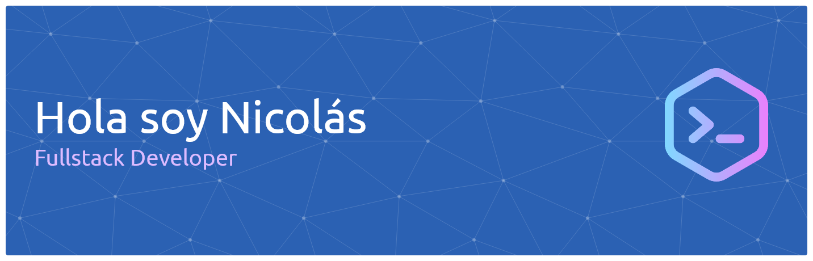

## ACERCA DE MI

Comencé a programar durante mi primer año estudiando Ingeniería en Sistemas, aprendiendo los fundamentos a través de pseudocódigo y luego Python como mi primer lenguaje. Desde el inicio participé en proyectos en equipo, lo que me permitió entender no solo cómo programar, sino también cómo construir software de forma colaborativa.

Actualmente curso la Tecnicatura Universitaria en Programación, donde continué fortaleciendo mis bases mientras profundizo en conceptos más avanzados del desarrollo de software. Durante estos últimos cinco años, mi interés por la programación fue creciendo de forma constante, especialmente cuando comencé a comprender que desarrollar software va mucho más allá de simplemente escribir código.

Aunque mi enfoque principal está en el desarrollo Backend, también tengo un gran interés por la experiencia de usuario y el diseño de interfaces. Disfruto pensar tanto en cómo se estructuran los sistemas internamente como en la forma en que los usuarios interactúan con ellos. En los últimos años, además, desarrollé un interés cada vez mayor por la arquitectura de software y el diseño limpio de sistemas.

Actualmente estoy enfocado en profundizar mis conocimientos en arquitectura y consolidar mis habilidades a través de proyectos que me exijan aprender sobre testing, despliegues y prácticas reales de desarrollo.

Tengo experiencia con HTML, CSS, JavaScript, Python, Java, C#, SQL Server, MongoDB, Redis y Docker.

Me interesan especialmente las oportunidades donde pueda aplicar bases sólidas, seguir aprendiendo y avanzar progresivamente hacia una especialización, contribuyendo al desarrollo de sistemas limpios, mantenibles y bien estructurados.

## CONTACTO

## SKILLS

                  

